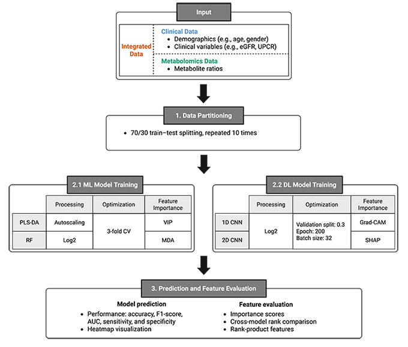
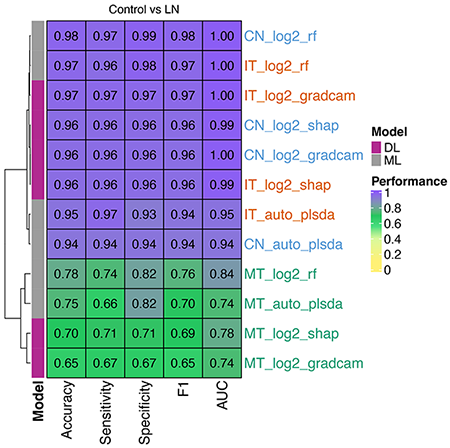
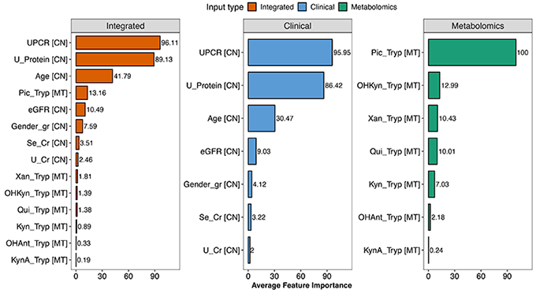
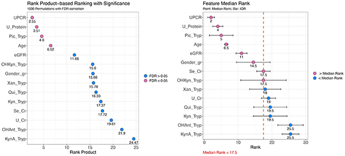
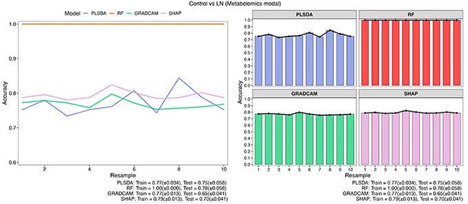
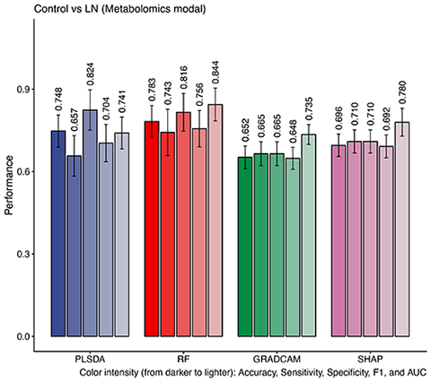

```{r, include = FALSE}
knitr::opts_chunk$set(
  collapse = TRUE,
  comment = "#>"
)
```

## INSTALLATION

1. Install prerequisite software and required packages (see [instruction](https://github.com/kwanjeeraw/MMFramework)).
2. Download MMFramework from [here](https://github.com/kwanjeeraw/MMFramework/blob/main/MMFramework.zip)
3. Unzip the downloaded MMFramework.zip file to your desired directory and this will be your working directory.
4. Run the framework script step-by-step as described in the next section.

## MMFramework
This tutorial demonstrates the analysis workflow using Case 1 (Control vs LN) from the manuscript. A schematic overview of the pipeline is presented in Figure 1.



### 0. Preparation of project working directory

The framework requires the following working directory structure:

```
MMFramework/
├── LN/
│   ├── clinical/
│   ├── metabolomics/
│   ├── integrated/
│   ├── input_integrated.csv
│   ├── input_clinical.csv
│   ├── input_metabolomics.csv
```

#### ***Input data***

The framework requires three input data types:

 - Clinical data (input_clinical.csv)
 - Metabolomics data (input_metabolomics.csv)
 - Integrated data (a concatenated table of clinical and metabolomics data, input_integrated.csv)

The input dataset should be a table containing the '*Index*' and '*Class*' columns, along with feature variables, as illustrated in Table 1. Categorical variables (e.g., gender) should be converted to numeric codes.

**Table 1**. Format of the input dataset. The '*Index*' and '*Class*' columns are mandatory (brown). This example of an integrated table includes clinical variables (blue) and metabolite features (green).

```{r,echo=FALSE, results='asis', message=FALSE, warning=FALSE}
library(knitr)
library(kableExtra)
dt = read.csv("ex_input.csv", row.names = NULL, check.names = FALSE)
dt[c(1:5,72:76), 1:14] %>%
  kable(row.names = FALSE) %>%
  kable_styling(c("striped", "bordered"), full_width = FALSE) %>%
  column_spec(1:2, bold = TRUE, background = '#a6761d') %>%
  column_spec(2, border_right = TRUE) %>%
  column_spec(3:9, bold = TRUE, background = '#5A9BD5') %>%
  column_spec(9, border_right = TRUE) %>%
  column_spec(10:14, background = '#1b9e77')
```

### 1. Data Partitioning (Optional)

This step creates training and test sets for model building. It is optional if training and test datasets are already available.

**Step:** Open R or RStudio → Generate training and test sets

 1\) Open R or RStudio, then set the working directory
 
 ```
 ##### SET WORKING DIRECTORY TO MMFRAMEWORK #####
 setwd("/Users/macuser/project/MMFramework/")

 ```

 2\)  Use one of the input tables (e.g., input_integrated.csv with the *Index* and *Class* columns) and run the following R command to generate training and test sets. The outputs will be saved as TrainList_biclass.txt and TestList_biclass.txt.
 
 ```
 source("create_train_test.R")
 ```

The outputs of this step are text files (.txt), each containing lists of resampled training and test indices in the following format:

Resample01: 1, 2, 3, 5, 6, 8, 9, 10, ...

Resample02: 1, 4, 5, 6, 7, 8, 9, 11, ...

Each number corresponds to a sample index (i.e., the '*Index*' column in the input dataset).

The provided R scripts perform random 70/30 (training/test) resampling repeated 10 times, as described in the manuscript. Users may apply alternative data partitioning methods if desired, provided that the output format is compatible with the framework.

### 2. Classification Model Building

In this step, classification models—including ML and DL approaches—are built independently for clinical-only, metabolomics-only, and integrative datasets.

**Step:** Open terminal → Go to the MMFramework directory → Run the script with required arguments → Check outputs in *outpath* directory

 1\) Open a terminal:
 
 - Windows: Command Prompt or PowerShell
 - macOS / Linux: Terminal
 
 2\) Navigate to the directory containing MMFramework, e.g.,
 
 ```
 cd /path/to/MMFramework
 ```
 
 3\) Run the following script for each input type by specifying the required arguments:

  - *--wkpath*: Working directory path of MMFramework (e.g., /path/to/MMFramework, default: current working directory)
  - *--proc*: Data processing method (options: log2, raw, auto, minmax; default: log2)
  - *--input*: Input file in CSV format (e.g., LN/input_clinical.csv)
  - *--outpath*: Output directory path (e.g., LN/clinical)
  - *--train*: Text file containing training indices (e.g., TrainList.txt)
  - *--test*: Text file containing test indices (e.g., TestList.txt)
  
 Additional arguments for DL models:
  
  - *--epoch*: Number of training epochs for DL models only (default: 200)
  - *--batch*: Number of training batch size for DL models only (default: 32)

 For this tutorial, each model is run three times—using integrated, clinical, and metabolomics data.
 
#### 2.1 ML models ####
#### ***PLS-DA***
```
Rscript Pls_run.R --wkpath /Users/macuser/project/MMFramework/ \
--proc auto \
--input LN/input_integrated.csv \
--outpath LN/integrated \
--train LN/TrainList_biclass.txt \
--test LN/TestList_biclass.txt
```

#### ***RF***
```
Rscript Rf_run.R --wkpath /Users/macuser/project/MMFramework/ \
--proc log2 \
--input LN/input_integrated.csv \
--outpath LN/integrated \
--train LN/TrainList_biclass.txt \
--test LN/TestList_biclass.txt
```

#### 2.2 DL models ####
#### ***Grad-CAM***
```
python3 Gradcam_run.py --wkpath /Users/macuser/project/MMFramework/ \
--proc log2 \
--input LN/input_integrated.csv \
--outpath LN/integrated \
--train LN/TrainList_biclass.txt \
--test LN/TestList_biclass.txt \
--epoch 200 \
--batch 32
```

#### ***SHAP***
```
python3 Shap_run.py --wkpath /Users/macuser/project/MMFramework/ \
--proc log2 \
--input LN/input_integrated.csv \
--outpath LN/integrated \
--train LN/TrainList_biclass.txt \
--test LN/TestList_biclass.txt \
--epoch 200 \
--batch 32
```

 4\) Model outputs
 
 The specified *outpath* directory contains all outputs from different integration strategies and modeling approaches. The corresponding file structure is illustrated below:

 ```
MMFramework/
├── LN/
│   ├── clinical/
│   ├── metabolomics/
│   ├── integrated/
│   │   ├── log2_rf_feature_rank.csv
│   │   ├── log2_rf_feature.csv
│   │   └── log2_rf_model.csv
│   │   ├── log2_rf_summary.pdf
│   ├── input_integrated.csv
│   ├── input_clinical.csv
│   ├── input_metabolomics.csv
│   ├── TrainList_biclass.txt
│   └── TestList_biclass.txt
 ```

### 3. Class Prediction and Feature Evaluation

This step generates results for model comparison and evaluation, as well as feature ranking comparisons.

**Step:** Open R or RStudio → Compute model performance → Plot

 1\) Open R or RStudio, then set the working directory and load the framework
 
 ```
 ##### SET WORKING DIRECTORY TO MMFRAMEWORK #####
 setwd("/Users/macuser/project/MMFramework/")

 ##### LOAD FRAMEWORK #####
 source("MMFramework.R")
 ```
 
 2\) Compute model performance for each input type
 
 Run the following R commands to generate ModelPerformance.csv for each input type:
 
  ```
  compute_model_performance(folder_path="LN/integrated") #for integrated data
  compute_model_performance(folder_path="LN/clinical") #for clinical data
  compute_model_performance(folder_path="LN/metabolomics") #for metabolomics data
  ```

#### 3.1 Plot a comparative performance heatmap
 
Run the following R commands to generate a heatmap comparing model performance across data modalities and modeling approaches (Figure 2).
 
```
input_list = c("IT"="LN/integrated","CN"="LN/clinical","MT"="LN/metabolomics")
plot_comparative_heatmap(input_list, title="Control vs LN")
```



#### 3.2 Plot cross-modal rank comparison
 
Run the following R commands to generate a cross-modal comparison of feature importance rankings. This script is executed for each modeling approach and uses the [xx]_feature.csv file from the modeling output. Modify *featureFile* as needed to generate a plot for a specific modeling approach.
 
```
input_list = c("IT"="LN/integrated","CN"="LN/clinical","MT"="LN/metabolomics")
featureFile = "log2_rf_feature.csv"
plot_cross_modal_rank(input_list, featureFile, title="Control vs LN")
```



#### 3.3 Plot combined rankings (2 plots)

Run the following R commands to generate a rank product-based ranking and feature median rank. This script is executed for each modeling approach and uses the [xx]_feature.csv file from the modeling output. Specify the required arguments:

  - *--featureFile*: File name for a specific modeling approach (e.g., log2_rf_feature.csv)
  - *--n_perm*: Number of permutations (default: 1000)
  - *--out_folder*: Output directory to save rankvalues_outputs.csv (e.g., LN)

```
input_list = c("IT"="LN/integrated","CN"="LN/clinical","MT"="LN/metabolomics")
featureFile = "log2_rf_feature.csv"
n_perm = 1000
out_folder = "LN"
combine_ranking(input_list, featureFile, n_perm=n_perm, out_folder=out_folder)
```



#### 3.4 Plot accuracy curves across training rounds (optional)
 
Run the following R commands to generate accuracy curves across training iterations. This step allows you to monitor model training performance for each data modality by specifying the *folder_path*

```
folder_path = "LN/metabolomics"
plot_cross_model_accuracy(folder_path, title="Control vs LN (Metabolomics modal)")
```



#### 3.5 Plot overall model performance (optional)
 
Run the following R commands to generate overall model performance. This step allows you to evaluate model prediction performance for each data modality by specifying the *folder_path*.
 
```
folder_path = "LN/metabolomics"
plot_cross_model_performance(folder_path, title="Control vs LN (Metabolomics modal)")
```



---
